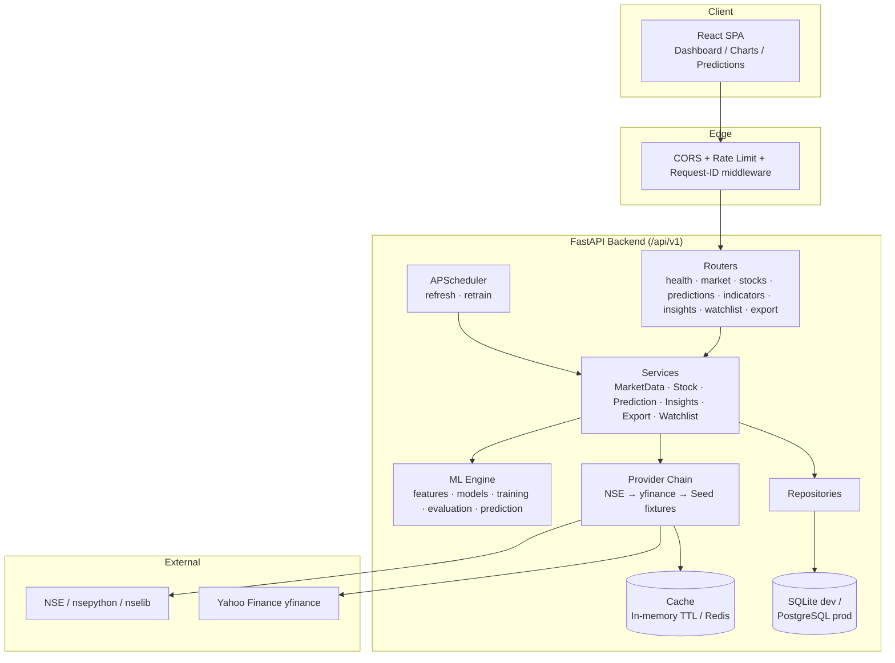
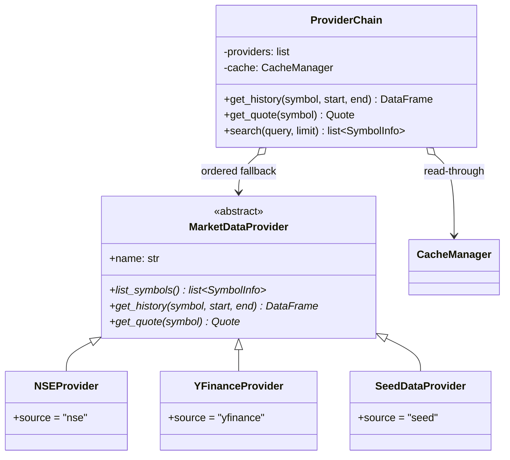
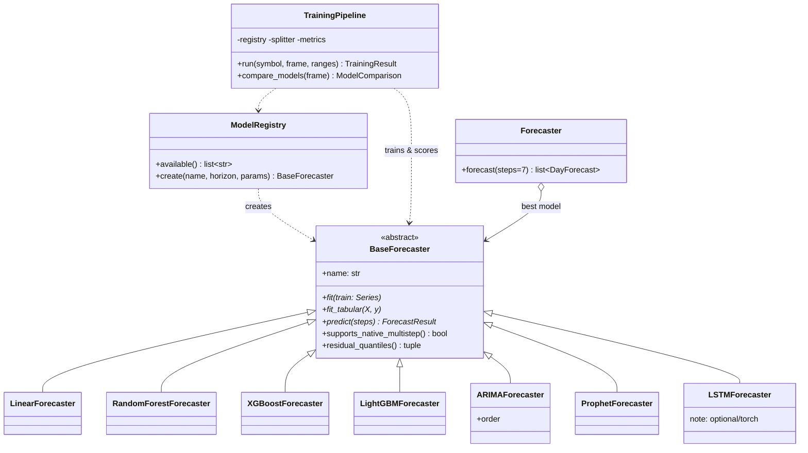
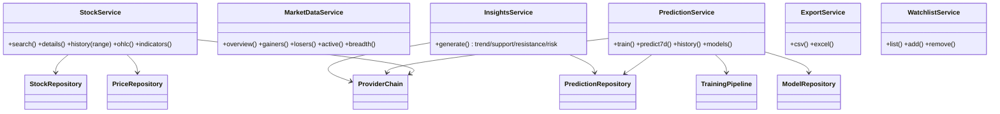

# StockSense AI — System Architecture

> Status: v1.2 · Last updated: 2026-07-19 · Owner: Platform Agent
> This document is the single source of truth for the system design. Update it whenever structure, boundaries, or contracts change.

## 1. Overview

StockSense AI is an AI-powered analytics and short-horizon forecasting platform for **NSE-listed Indian equities**. It follows **Clean Architecture** with strict dependency direction:

```
API Layer (FastAPI routers, schemas)
   └─> Services (use-cases / orchestration)
        └─> Repositories (persistence) ──> SQLAlchemy models ──> DB
        └─> Providers (external data)  ──> Cache
        └─> ML Engine (features → train → evaluate → predict)
```

Rules:
- `api/` never imports `ml/` or `repositories/` directly — only `services/` + `schemas/`.
- `services/` never builds SQL strings — they go through `repositories/`.
- `ml/` is persistence-agnostic: it consumes `pandas.DataFrame` and returns plain dataclasses/DTOs. The service layer handles saving results.
- `providers/` never talk to the database; caching is injected.
- Everything is **dependency-injected** via constructors + FastAPI `Depends` (composition root in `api/deps.py`).

## 2. High-Level Component Diagram



## 3. Folder Structure

```
Stock-App/
├── docs/                      # Multi-agent documentation (see docs/module_index.md)
├── backend/
│   ├── app/
│   │   ├── main.py            # FastAPI factory, middleware, lifespan
│   │   ├── api/
│   │   │   ├── deps.py        # Composition root (DI providers)
│   │   │   ├── middleware.py  # rate limit, request-id, timing
│   │   │   └── v1/
│   │   │       ├── router.py  # aggregates all v1 routers
│   │   │       └── routes/    # one module per resource
│   │   ├── core/
│   │   │   ├── config.py      # pydantic-settings, env-driven
│   │   │   ├── logging.py     # structured logging setup
│   │   │   └── constants.py   # ranges, horizons, enums
│   │   ├── database/
│   │   │   ├── base.py        # Declarative base + naming
│   │   │   ├── session.py     # engine/session factories (sqlite/pg)
│   │   │   └── models/        # ORM models (8 tables)
│   │   ├── repositories/      # data access, one repo per aggregate
│   │   ├── schemas/           # Pydantic DTOs (request/response)
│   │   ├── services/          # use-case orchestration
│   │   ├── providers/         # market-data provider chain
│   │   ├── ml/
│   │   │   ├── data/          # loaders, preprocessing
│   │   │   ├── features/      # technical indicators, engineering
│   │   │   ├── models/        # forecaster implementations + registry
│   │   │   ├── training/      # pipeline, splitter, versioning
│   │   │   ├── evaluation/    # metrics (RMSE/MAE/MAPE/R²)
│   │   │   └── prediction/    # 7-day forecaster + intervals
│   │   ├── scheduler/         # APScheduler jobs
│   │   ├── cache/             # TTL cache backends + manager
│   │   ├── utils/             # exports, time helpers
│   │   └── data/seed/         # NSE universe + offline fixture generator
│   ├── scripts/               # seed_db.py, demo_train.py
│   └── tests/                 # unit / integration / api
├── frontend/                  # React + TypeScript + Vite
│   └── src/{components,pages,hooks,lib,store,styles}
├── deploy/                    # Dockerfiles, compose, render/railway notes
└── .github/workflows/ci.yml
```

## 4. Design Decisions (summary — full log in [decisions.md](decisions.md))

| # | Decision | Rationale |
|---|----------|-----------|
| D1 | Clean Architecture + DI | Swap providers/DB/ML models without touching API layer |
| D2 | Provider **chain** with deterministic seed fallback | App is fully functional offline & in CI; real data when network available |
| D3 | **Direct multi-horizon** strategy (7 models, one per day-ahead) for ML models; recursive for ARIMA-family | Avoids recursive error compounding for supervised models; statistically cleaner per-horizon CIs |
| D4 | Conformal-style **residual-quantile** confidence intervals | Model-agnostic, honest intervals without distributional assumptions |
| D5 | Soft-optional heavy deps (Prophet/Torch/LightGBM/XGBoost/CatBoost) via registry guards | Backend installs & tests everywhere; GPU/TS libs added per environment |
| D6 | Sync SQLAlchemy 2.0 + threadpool | ML is CPU-bound sync anyway; keeps repos simple & testable |
| D7 | SQLite dev / Postgres prod via single `DATABASE_URL` | Zero-config dev, container-ready prod |

## 5. Class Diagrams

### 5.1 Provider layer


### 5.2 ML engine


### 5.3 Services layer


## 6. Cross-Cutting Concerns

| Concern | Implementation |
|---|---|
| Config | `pydantic-settings` (`Settings`), env vars, `.env` support, per-environment defaults |
| Logging | stdlib `logging`, `Request-ID` middleware, structured key=value format, per-module loggers |
| Caching | Two-layer: L1 in-process TTL dict (thread-safe) → L2 Redis (optional, graceful) |
| Rate limiting | In-memory sliding-window per-IP middleware (configurable); Redis-backed in prod roadmap |
| Errors | Domain exceptions → `api/errors.py` handlers → RFC7807-ish JSON `{detail, code}` |
| Versioning | URL prefix `/api/v1`; DTOs versioned with routers |
| Security | Input validation (Pydantic), ticker allowlist regex, bounded query params, secrets via env only |
| Observability | `/api/v1/health` + `/api/v1/ready`; request timing header; training-run metrics persisted |

## 7. Data Flow — "Predict next 7 days"

1. `POST /api/v1/predictions/train {symbol, range}` → `PredictionService.train`
2. Load history: cache → DB → provider chain → upsert DB.
3. `FeatureEngineer` builds indicator matrix (SMA/EMA/RSI/MACD/ATR/BB/VWAP/OBV/ROC/momentum/volatility/lags/rolling/calendar).
4. `TimeSeriesSplitter` → last N sessions as validation.
5. Each available model fits (per-horizon for supervised); metrics computed (RMSE/MAE/MAPE/R²).
6. `TrainingRun` + per-model `Model` rows persisted (versioned `v{symbol}:{model}:{ts}`).
7. Best model (lowest RMSE, tie → MAPE → MAE) re-fit on full window.
8. `POST /api/v1/predictions/{symbol}` → 7 `DayForecast` (point + P05/P95 bounds, expected change %, confidence label) persisted to `predictions`.

## 8. Scalability Notes

- Stateless API pods; heavy training moved to background workers (Celery/Redis — see roadmap R2.3).
- Price history partitioned by symbol (Postgres) + covering index `(symbol, date)`.
- Provider calls de-duplicated via cache keys `{provider}:{symbol}:{start}:{end}` with tiered TTL (EOD data immutable, intraday short TTL).
