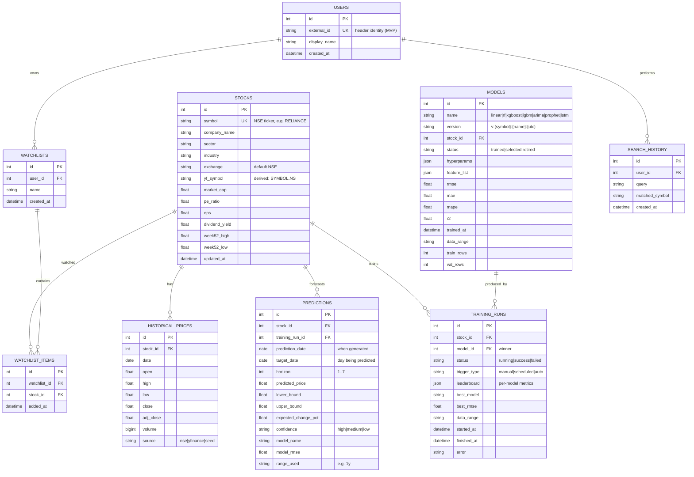

# Database Schema — StockSense AI

> Status: v1.1 · Last updated: 2026-07-19
> ORM source of truth: `backend/app/database/models/`. Engines: SQLite (dev), PostgreSQL (prod) via `DATABASE_URL`.
> Migrations: Alembic planned (R5.5); dev uses `Base.metadata.create_all`.

## ER Diagram

## Indexes

| Table | Index | Purpose |
|---|---|---|
| historical_prices | UNIQUE (stock_id, date) + IX (stock_id, date DESC) | upsert + range scans |
| predictions | IX (stock_id, prediction_date DESC) | latest forecast retrieval |
| predictions | IX (stock_id, target_date, horizon) | per-day lookup |
| models | IX (stock_id, trained_at DESC), UNIQUE(version) | latest model, idempotent versioning |
| stocks | IX (symbol), FTS-friendly columns (company_name, sector, industry) | search |
| watchlist_items | UNIQUE (watchlist_id, stock_id) | dup prevention |
| search_history | IX (user_id, created_at DESC) | recents |

## Retention & Growth

- `historical_prices`: ~130 symbols × 6000 sessions (max range) ≈ 0.8 M rows seeded; growth ~130/day.
- `predictions`: 7 rows per request per symbol; pruned older than 90 days by scheduled job (roadmap).
- SQLite pragmas set on connect: `journal_mode=WAL`, `synchronous=NORMAL`, `foreign_keys=ON`.
