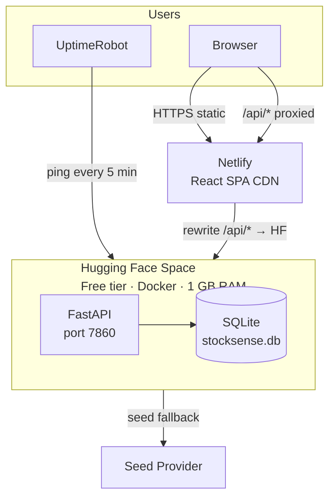
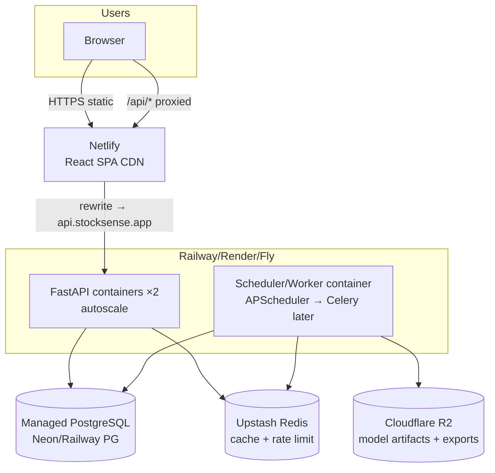

# Deployment Architecture — StockSense AI

> Status: v1.1 · Last updated: 2026-07-23 · Updated for Hugging Face Spaces (free tier) + Netlify + UptimeRobot.

## 1. Recommended Production Topology (Free Tier)



| Tier | Choice | Why |
|---|---|---|
| Frontend | **Netlify** | SPA CDN, instant rollbacks, `netlify.toml` SPA redirect + `/api` proxy |
| Backend | **Hugging Face Space** (free) | Docker SDK, 2 vCPU / 16 GB RAM (1 GB practical limit), no external DB needed |
| DB | **SQLite** (embedded) | Zero-config, persistent within container layer for free tier |
| Cache | **In-memory TTL** | No Redis on free tier; graceful degradation |
| Keep-Alive | **UptimeRobot** → `/ping` | Prevents HF Space sleep after 48 h inactivity |
| CORS | **Netlify domain** in `CORS_ORIGINS` | Allows frontend to call backend directly |

**Alternative paid tier:** Railway/Render + PostgreSQL + Redis + Cloudflare R2 (see original architecture).

## 1b. Original Recommended Topology (Paid / Scale)



**Python-only alternative:** Streamlit or Reflex on Railway — recommended only for internal/analyst builds; the React SPA is the production frontend. (Decision ADR-0005.)

## 2. Environments

| Env | API | DB | Cache | Notes |
|---|---|---|---|---|
| dev | `uvicorn --reload` :8000 | SQLite `./stocksense.db` | in-memory TTL | seed provider fallback OK |
| ci | testcontainers-less: sqlite tmp | SQLite tmp | in-memory | provider network mocked |
| prod | gunicorn+uvicorn workers | `postgresql+psycopg://…` | `REDIS_URL` Upstash | seed fallback **disabled** (`SEED_FALLBACK=false`) |

## 3. Environment Variables (backend)

| Var | Default | Notes |
|---|---|---|
| `ENV` | `dev` | `dev\|ci\|prod` |
| `DATABASE_URL` | `sqlite:///./stocksense.db` | prod: postgres URL |
| `REDIS_URL` | _empty_ | enables Redis cache + shared rate limit |
| `CORS_ORIGINS` | `http://localhost:5173` | comma list; prod: netlify domain |
| `RATE_LIMIT_PER_MINUTE` | `120` | per IP |
| `SEED_FALLBACK` | `true` | `false` in prod |
| `PROVIDER_TIMEOUT_S` | `8` | per-provider HTTP budget |
| `TRAIN_MAX_RANGE_YEARS` | `10` | guardrail |
| `SCHEDULER_ENABLED` | `true` | disable on API replicas if worker split |
| `LOG_LEVEL` | `INFO` | |
| `MODEL_ARTIFACTS_BUCKET` | _empty_ | R2 bucket (R2.9) |

Secrets: platform secret stores (Railway/Netlify env UI); **never** in git. `.env.example` documents keys only.

## 4. Build & Run

```bash
# local all-in-one
docker compose -f deploy/docker-compose.yml up --build   # api:8000 web:5173 db redis
# backend only
pip install -e ".[dev]" && uvicorn backend.app.main:app --reload
# frontend only
cd frontend && npm ci && npm run dev
```

## 5. CI/CD

GitHub Actions (`ci.yml`): python 3.11/3.13 matrix → ruff → mypy(strict-ish on typed pkgs) → pytest+ cov; node 20 → `npm ci`, `tsc`, `vite build`. Deploy: Netlify GitHub app (frontend dir), Railway watches `main` (backend Dockerfile). Releases tagged `v*`

## 6. SLOs & Capacity

| Metric | Target |
|---|---|
| `/health`, `/ready` | p95 < 50 ms |
| history (cached) | p95 < 150 ms |
| history (provider fetch) | p95 < 2.5 s |
| train+forecast (2y, 3 models) | p95 < 8 s |
| forecast (post-train) | p95 < 300 ms |

Scale notes: sticky nothing; API is stateless. Move training to Celery workers when concurrent trains > ~5 (threadpool guard `MAX_CONCURRENT_TRAINS=4` interim).

## 7. Compliance Notes
- NSE data: use official/licensed endpoints only; respect robots + terms; cache EOD data, do not redistribute raw feeds.
- yfinance is a **fallback for development** — verify licensing posture before commercial redistribution.
- The deterministic `seed` provider is synthetic — always labeled, never presented as market truth.

## 8. Hugging Face Spaces Deployment (Free Tier)

### 8.1 Build artifacts added
- `Dockerfile` — slim `python:3.11-slim` image, exposes `7860`, runs single uvicorn worker.
- `requirements-hf.txt` — excludes heavy libraries (`torch`, `prophet`, `xgboost`, `lightgbm`) to stay within 1 GB RAM.
- `.env.huggingface` — conservative settings (`MAX_CONCURRENT_TRAINS=1`, `ML_MAX_TRAINING_ROWS=750`).
- `README_SPACE.md` — required YAML frontmatter (`sdk: docker`, `app_port: 7860`) for HF Spaces.
- `uptime_server.py` — standalone lightweight FastAPI server for UptimeRobot (optional; `/ping` on main app is sufficient).

### 8.2 Deploy steps
1. Create Space at https://huggingface.co/spaces (SDK: Docker, Hardware: CPU basic/free).
2. Push `Dockerfile`, `requirements-hf.txt`, `backend/`, `.env.huggingface`, `README_SPACE.md` (renamed to `README.md` in Space repo).
3. Set Space Variables (`ENV=prod`, `CORS_ORIGINS=https://your-netlify-site.netlify.app`, `DATABASE_URL=sqlite:///./stocksense.db`).
4. Wait for Docker build (watch **Logs** tab). App available at `https://YOUR_USERNAME-YOUR_SPACE.hf.space/`.
5. Verify with `curl https://.../ping` and `https://.../docs`.

### 8.3 Memory footprint
- Base image: ~50 MB
- Installed slim packages: ~250 MB
- SQLite DB (after seed): ~5 MB
- Running memory (1 uvicorn + 1 train): ~300-500 MB
- Comfortable headroom within the 1 GB practical limit.

## 9. Netlify Deployment (Frontend)

### 9.1 Build settings (already in repo)
- `frontend/netlify.toml`: `command = "npm run build"`, `publish = "dist"`, SPA redirect `/* → /index.html`.
- `frontend/src/config/env.ts`: reads `VITE_API_BASE` (must start with `VITE_` for Vite to expose it).

### 9.2 Deploy steps
1. Import repo at https://app.netlify.com/ → set Base directory = `frontend`.
2. Build command: `npm run build` · Publish directory: `dist`.
3. Environment variables (`Site settings → Build & deploy → Environment variables`):
   - `VITE_API_BASE` = `https://YOUR_USERNAME-YOUR_SPACE.hf.space/api/v1`
4. Optional proxy (avoid CORS): uncomment `[[redirects]]` block in `frontend/netlify.toml` pointing to your HF Space URL.
5. Redeploy (`Deploys → Trigger deploy`).

### 9.3 Link backend and frontend
- Netlify `VITE_API_BASE` points to HF Space `/api/v1`.
- HF Space `CORS_ORIGINS` includes the Netlify domain (`https://...netlify.app`).
- If using Netlify proxy (`/api/* → HF`), `CORS_ORIGINS` can remain broad or include `*`.

## 10. UptimeRobot Setup (Keep 24/7 Awake)

Free HF Spaces sleep after ~48 hours of inactivity. UptimeRobot pings prevent sleep.

1. Sign up at https://uptimerobot.com/
2. **Add New Monitor** → Type: `HTTP(s)`
3. **URL/IP**: `https://YOUR_USERNAME-YOUR_SPACE.hf.space/ping`
4. **Interval**: Every 5 minutes (free tier minimum)
5. Save. The `/ping` endpoint responds instantly (`{"status":"ok"}`) with minimal memory/CPU.

The standalone `uptime_server.py` can also be used locally or on a separate port if needed, but for HF the built-in `/ping` route in `main.py` is sufficient and avoids running an extra process.
