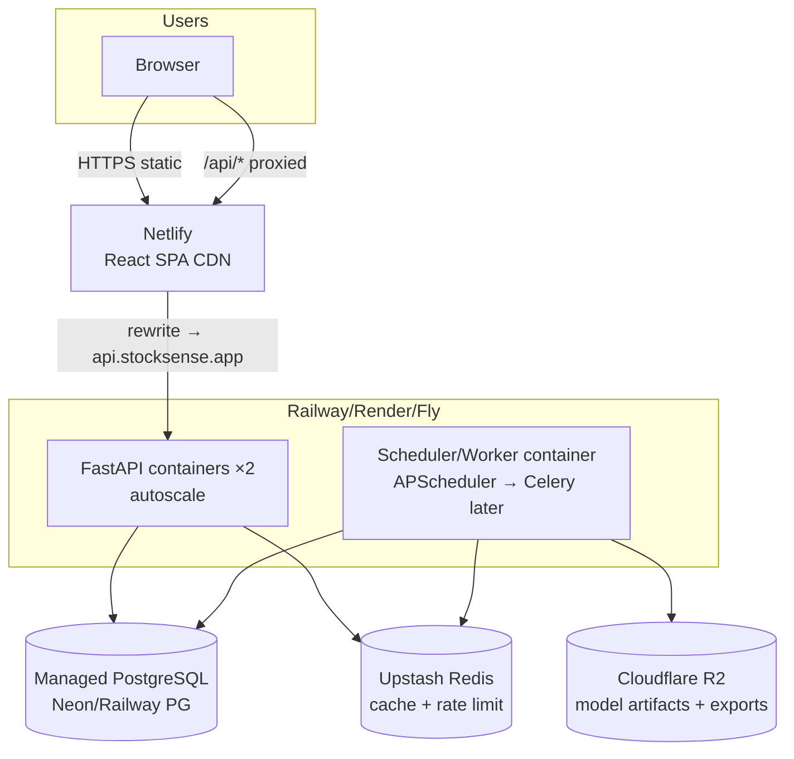

# Deployment Architecture — StockSense AI

> Status: v1.0 · Last updated: 2026-07-19
> Repo ships: `backend/Dockerfile`, `frontend/Dockerfile`(+nginx), `deploy/docker-compose.yml`, `.github/workflows/ci.yml`.

## 1. Recommended Production Topology



| Tier | Choice | Why |
|---|---|---|
| Frontend | **Netlify** | SPA CDN, instant rollbacks, `netlify.toml` SPA redirect + `/api` proxy |
| Backend | **Railway** (alt: Render, Fly.io) | Containers from repo, healthchecks, zero-downtime |
| DB | Railway PG or **Neon** | Postgres 16, pooling (pgBouncer on Neon) |
| Cache | **Upstash Redis** | serverless, per-request billing, TLS |
| Artifacts | **Cloudflare R2** | S3-compatible, no egress fees (model bundles, exports) |
| DNS/TLS | Cloudflare | WAF, CDN, mTLS to origin optional |

**Python-only alternative:** Streamlit or Reflex on Railway — recommended only for internal/analyst builds; the React SPA is the production frontend. (Decision ADR-0005.)

## 2. Environments

| Env | API | DB | Cache | Notes |
|---|---|---|---|---|
| dev | `uvicorn --reload` :8000 | SQLite `./stocksense.db` | in-memory TTL | seed provider fallback OK |
| ci | testcontainers-less: sqlite tmp | SQLite tmp | in-memory | provider network mocked |
| prod | gunicorn+uvicorn workers | `postgresql+psycopg://…` | `REDIS_URL` Upstash | seed fallback **disabled** (`SEED_FALLBACK=false`) |

## 3. Environment Variables (backend)

| Var | Default | Notes |
|---|---|---|
| `ENV` | `dev` | `dev\|ci\|prod` |
| `DATABASE_URL` | `sqlite:///./stocksense.db` | prod: postgres URL |
| `REDIS_URL` | _empty_ | enables Redis cache + shared rate limit |
| `CORS_ORIGINS` | `http://localhost:5173` | comma list; prod: netlify domain |
| `RATE_LIMIT_PER_MINUTE` | `120` | per IP |
| `SEED_FALLBACK` | `true` | `false` in prod |
| `PROVIDER_TIMEOUT_S` | `8` | per-provider HTTP budget |
| `TRAIN_MAX_RANGE_YEARS` | `10` | guardrail |
| `SCHEDULER_ENABLED` | `true` | disable on API replicas if worker split |
| `LOG_LEVEL` | `INFO` | |
| `MODEL_ARTIFACTS_BUCKET` | _empty_ | R2 bucket (R2.9) |

Secrets: platform secret stores (Railway/Netlify env UI); **never** in git. `.env.example` documents keys only.

## 4. Build & Run

```bash
# local all-in-one
docker compose -f deploy/docker-compose.yml up --build   # api:8000 web:5173 db redis
# backend only
pip install -e ".[dev]" && uvicorn backend.app.main:app --reload
# frontend only
cd frontend && npm ci && npm run dev
```

## 5. CI/CD

GitHub Actions (`ci.yml`): python 3.11/3.13 matrix → ruff → mypy(strict-ish on typed pkgs) → pytest+ cov; node 20 → `npm ci`, `tsc`, `vite build`. Deploy: Netlify GitHub app (frontend dir), Railway watches `main` (backend Dockerfile). Releases tagged `v*`

## 6. SLOs & Capacity

| Metric | Target |
|---|---|
| `/health`, `/ready` | p95 < 50 ms |
| history (cached) | p95 < 150 ms |
| history (provider fetch) | p95 < 2.5 s |
| train+forecast (2y, 3 models) | p95 < 8 s |
| forecast (post-train) | p95 < 300 ms |

Scale notes: sticky nothing; API is stateless. Move training to Celery workers when concurrent trains > ~5 (threadpool guard `MAX_CONCURRENT_TRAINS=4` interim).

## 7. Compliance Notes
- NSE data: use official/licensed endpoints only; respect robots + terms; cache EOD data, do not redistribute raw feeds.
- yfinance is a **fallback for development** — verify licensing posture before commercial redistribution.
- The deterministic `seed` provider is synthetic — always labeled, never presented as market truth.
