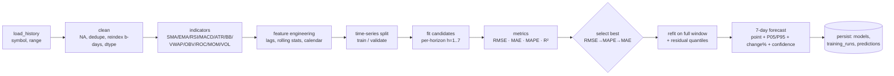

# ML Pipeline — StockSense AI

> Status: v1.1 · Last updated: 2026-07-19
> Code: `backend/app/ml/`. The ML engine is persistence-agnostic: DataFrames in, dataclasses out.

## 1. End-to-End Flow



## 2. Preprocessing (`ml/data/preprocessing.py`)

| Step | Rule |
|---|---|
| Sort & dedupe | by date; last write wins |
| Gap handling | reindex to business days; OHLC **ffill limit=2**; volume fill 0; drop still-missing |
| Outliers | winsorize returns at 1%/99% for feature stability (prices kept raw for targets) |
| Types | float32 features, float64 targets |
| Minimum history | 120 sessions required to train; ranges auto-widen when provider returns less |

## 3. Indicator Catalog (`ml/features/technical_indicators.py`)

All vectorized pandas/numpy; no look-ahead (everything uses `t` and earlier):

| Indicator | Params | Notes |
|---|---|---|
| SMA / EMA | 5, 10, 20, 50, 100, 200 | ratios `close/sma_n` used as stationary features |
| RSI | 14 | Wilder smoothing |
| MACD | 12/26/9 | line, signal, histogram |
| ATR | 14 | Wilder TR average |
| Bollinger | 20, 2σ | width & %B |
| VWAP | session | cumulative daily approximation for EOD data |
| OBV | — | signed volume cumulative |
| ROC / Momentum | 5, 10, 21 | pct & diff variants |
| Volatility | 10, 21 | rolling std of log returns, annualized |
| Lags | 1,2,3,5,10,21 | returns + close lags |
| Rolling stats | 5,10,21 | mean/std/min/max of returns |
| Calendar | dow, dom, month, quarter | sin/cos encoded |

## 4. Models (`ml/models/`)

| Model | Strategy | Dep | Always on |
|---|---|---|---|
| `linear` (baseline) | direct, per-horizon Ridge | sklearn | ✅ |
| `random_forest` | direct, per-horizon | sklearn | ✅ |
| `xgboost` | direct, per-horizon | xgboost | guarded |
| `lightgbm` | direct, per-horizon | lightgbm | guarded |
| `arima` | native recursive | statsmodels | guarded |
| `prophet` | native recursive | prophet | guarded |
| `lstm` | seq2one recursive | torch | guarded |
| `catboost` / `gru` | — | — | roadmap |

**Direct multi-horizon:** target is `close_{t+h}`. Feature row `X_t` uses values known at close of `t`. Final forecast rolls the feature frame forward 7 days using recursive assumptions (future lag returns = model's own predicted path; calendar exact; indicators recomputed on the extended close series each step). See ADR-0009.

## 5. Validation & Metrics (`ml/evaluation/metrics.py`)

- Split: contiguous **hold-out last `min(30, 15%)` sessions** (no shuffling, ever).
- Metrics: RMSE, MAE, MAPE (ε-guarded), R² on validation closes.
- Selection: sort key `(rmse, mape, mae)`; winner refit on train+validation before forecasting.
- Model comparison endpoint returns the full leaderboard (`TrainingPipeline.compare_models`).

## 6. Confidence Intervals

1. Validation residuals `e_i = y_i − ŷ_i` per horizon.
2. Quantiles `q05_h, q95_h` (empirical; min 0.5% of price as floor to avoid degenerate 0-width).
3. Forecast day h → `[ŷ_h + q05_h, ŷ_h + q95_h]`; native intervals preferred when model provides them (ARIMA/Prophet).
4. **Confidence label** from relative half-width `w = (upper−lower)/2 / ŷ`: `high < 2%`, `medium < 5%`, else `low`.

## 7. Training Pipeline API

```python
result = TrainingPipeline(registry).run(frame=ohlcv_df, symbol="RELIANCE", data_range="2y")
# result.leaderboard -> [ModelMetrics(name, rmse, mae, mape, r2, train_s, ...)]
# result.best        -> fitted ForecasterBundle (model + feature spec + residual quantiles)
forecasts = Forecaster(result.best).forecast(steps=7)
# [DayForecast(date, price, lower, upper, change_pct, confidence)]
```

## 8. Versioning & Reproducibility

- Model version = `v:{symbol}:{model}:{UTC ISO}`; hyperparams + feature list + window + metrics persisted to `models`.
- `random_state` fixed (`SEED=42`) everywhere; numpy seeded in pipeline entrypoint.
- Artifacts (fitted estimators) are **not** stored in DB (size); refit-on-demand is seconds at current scale. R2.9 moves winners to object storage (R2) with `version` key.

## 9. Scheduled Retraining

APScheduler jobs (`backend/app/scheduler/jobs.py`):
- `refresh_prices` Mon–Fri 15:45 IST (post-EOD)
- `retrain_watchlisted` nightly 21:30 IST — incremental (only symbols whose newest price row is fresher than last `TrainingRun.finished_at`), keeps `keep_last=3` runs per symbol.

## 10. Known Limits (see [known_issues.md](known_issues.md))

- Direct multi-horizon ML does not model cross-day covariance between horizons (intervals marginal, not joint).
- Seed-provider data is synthetic — clearly labeled; never train production decisions on it.
- ARIMA order fixed (2,1,2) with fixed `enforce_stationarity=False` for speed; Optuna/SARIMAX seasonal sweep is R2.8.
